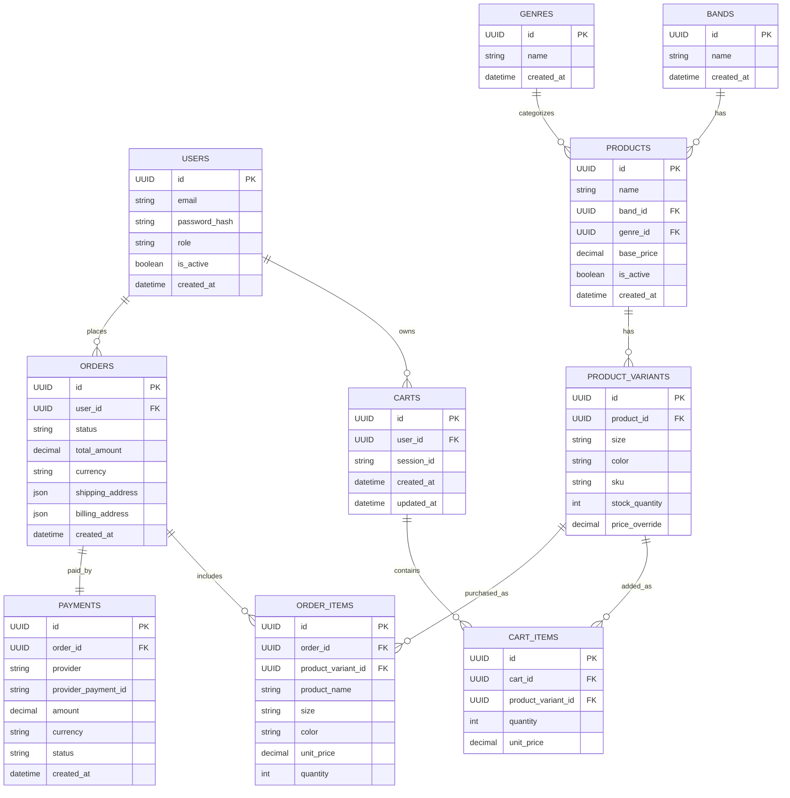

# Music Band T-Shirt E-Commerce – MVP Database Design

This document describes the **MVP database schema** for the Music Band T-Shirt E-Commerce backend.
The design focuses on supporting the full purchase flow while remaining simple, scalable, and correct from a commerce perspective.

---

## Design Goals

- Enable a complete e-commerce flow (browse → cart → checkout → payment)
- Keep schema minimal and MVP-friendly
- Correctly model apparel inventory (size/color per SKU)
- Preserve clean upgrade paths for future features

---

## Core Modeling Principle

- **Products** represent the *design / concept*
- **Product Variants** represent the *actual sellable units* (size + color)

> Any attribute that affects **stock, price, or checkout** belongs to `product_variants`, not `products`.

---

## Tables Overview

## Users

### `users`
- id (UUID, PK)
- email (unique)
- password_hash
- role (`customer`, `admin`)
- is_active
- created_at

---

## Catalog

### `bands`
- id (UUID, PK)
- name (unique)
- created_at

### `genres`
- id (UUID, PK)
- name (unique)
- created_at

### `products`
Represents a T-shirt **design**, not a sellable unit.

- id (UUID, PK)
- name
- band_id (FK → bands.id)
- genre_id (FK → genres.id)
- base_price
- is_active
- created_at

**Important**
- No size
- No color
- No stock
- No SKU

---

### `product_variants`
Represents **sellable SKUs** (size + color).

- id (UUID, PK)
- product_id (FK → products.id)
- size (e.g. S, M, L, XL)
- color
- sku (unique)
- stock_quantity
- price_override (nullable)

---

## Cart

### `carts`
- id (UUID, PK)
- user_id (nullable, FK → users.id)
- session_id (nullable)
- created_at
- updated_at

### `cart_items`
- id (UUID, PK)
- cart_id (FK → carts.id)
- product_variant_id (FK → product_variants.id)
- quantity
- unit_price

---

## Orders

### `orders`
- id (UUID, PK)
- user_id (nullable, FK → users.id)
- status (`pending`, `paid`, `cancelled`)
- total_amount
- currency
- shipping_address (JSON / TEXT snapshot)
- billing_address (JSON / TEXT snapshot)
- created_at

### `order_items`
Snapshot of purchased variants.

- id (UUID, PK)
- order_id (FK → orders.id)
- product_variant_id (FK → product_variants.id)
- product_name
- size
- color
- unit_price
- quantity

---

## Payments

### `payments`
- id (UUID, PK)
- order_id (FK → orders.id)
- provider (`stripe`)
- provider_payment_id
- amount
- currency
- status (`pending`, `succeeded`, `failed`)
- created_at

---

## Entity Relationship Diagram (Mermaid)

---

## Notes

- Size and color exist **only** in `product_variants`
- Orders store size/color as immutable snapshots
- Schema is optimized for MVP correctness, not shortcuts

---

**Status:** Approved for MVP implementation
