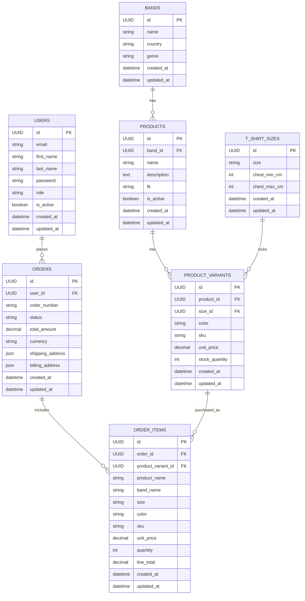

# Music Band T-Shirt E-Commerce - MVP Database Design

This document defines the **V1 database schema** for the Music Band T-Shirt E-Commerce MVP.
The design keeps the model simple while covering the full purchase flow (browse catalog -> place order), using seven tables:

- users
- bands
- products
- t_shirt_sizes
- product_variants
- orders
- order_items

---

## Design Goals

- Support the MVP purchase flow with a minimal, easy-to-read schema
- Model apparel inventory correctly (size per SKU)
- Keep immutable snapshots for order history
- Preserve a clean upgrade path for V2 features (payments, carts, coupons, etc.)

---

## Core Modeling Principle

- **Products** represent the T-shirt *design* (no size, no price, no stock)
- **Product Variants** represent the *actual sellable units* (size + price + stock)
- **T-Shirt Sizes** are a lookup table referenced by `product_variants.size_id`

> Any attribute that affects stock, price, or checkout belongs to `product_variants`, not `products`.

---

## Table Schemas

All tables follow the same conventions:

- `id` - UUID primary key
- `created_at` - TIMESTAMPTZ, defaults to now
- `updated_at` - TIMESTAMPTZ, defaults to now, updated on change

## Users

### `users`

- id (UUID, PK)
- email (VARCHAR 255, unique, indexed)
- first_name (VARCHAR 50)
- last_name (VARCHAR 50)
- password (VARCHAR 60) - bcrypt hash
- role (VARCHAR 8) - `customer` | `admin`
- is_active (BOOLEAN)
- created_at (TIMESTAMPTZ)
- updated_at (TIMESTAMPTZ)

---

## Catalog

### `bands`

- id (UUID, PK)
- name (VARCHAR 150, unique)
- country (VARCHAR 100, nullable)
- genre (VARCHAR 100, nullable)
- created_at (TIMESTAMPTZ)
- updated_at (TIMESTAMPTZ)

### `t_shirt_sizes`

Size lookup table. Represents a standardized size, not a per-product value.

- id (UUID, PK)
- size (VARCHAR 10, unique) - `XXS` | `XS` | `S` | `M` | `L` | `XL` | `XXL` | `XXXL`
- chest_min_cm (INTEGER, nullable)
- chest_max_cm (INTEGER, nullable)
- created_at (TIMESTAMPTZ)
- updated_at (TIMESTAMPTZ)

### `products`

Represents a T-shirt **design**, not a sellable unit.

- id (UUID, PK)
- band_id (UUID, FK -> bands.id, nullable)
- name (VARCHAR 150)
- description (TEXT, nullable)
- fit (VARCHAR 20) - `unisex` | `men` | `women` | `oversized`
- is_active (BOOLEAN, default true)
- created_at (TIMESTAMPTZ)
- updated_at (TIMESTAMPTZ)

**Important**

- No size
- No stock
- No SKU

### `product_variants`

Represents **sellable SKUs** (one per size).

- id (UUID, PK)
- product_id (UUID, FK -> products.id)
- size_id (UUID, FK -> t_shirt_sizes.id)
- color (VARCHAR 50, default `black`)
- sku (VARCHAR 50, unique)
- unit_price (NUMERIC 12,2)
- stock_quantity (INTEGER, default 0)
- created_at (TIMESTAMPTZ)
- updated_at (TIMESTAMPTZ)

Recommended unique constraint:

- unique(product_id, size_id, color)

---

## Orders

### `orders`

- id (UUID, PK)
- user_id (UUID, FK -> users.id, nullable) - null for guest checkout
- order_number (VARCHAR, unique) - `ORD-YYYYMMDD-XXXXXX`
- status (VARCHAR) - `pending` | `paid` | `cancelled`
- total_amount (NUMERIC 12,2)
- currency (VARCHAR 3, default `USD`)
- shipping_address (JSONB, immutable snapshot)
- billing_address (JSONB, immutable snapshot)
- created_at (TIMESTAMPTZ)
- updated_at (TIMESTAMPTZ)

### `order_items`

Snapshot of purchased variants at the time of the order.

- id (UUID, PK)
- order_id (UUID, FK -> orders.id)
- product_variant_id (UUID, FK -> product_variants.id)
- product_name (VARCHAR 150) - snapshot
- band_name (VARCHAR 150, nullable) - snapshot
- size (VARCHAR 10) - snapshot
- color (VARCHAR 50) - snapshot
- sku (VARCHAR 50) - snapshot
- unit_price (NUMERIC 12,2) - snapshot
- quantity (INTEGER)
- line_total (NUMERIC 12,2)
- created_at (TIMESTAMPTZ)
- updated_at (TIMESTAMPTZ)

---

## Entity Relationship Diagram (Mermaid)

```mermaid
erDiagram

    USERS {
        UUID id PK
        string email
        string first_name
        string last_name
        string password
        string role
        boolean is_active
        datetime created_at
        datetime updated_at
    }

    BANDS {
        UUID id PK
        string name
        string country
        string genre
        datetime created_at
        datetime updated_at
    }

    T_SHIRT_SIZES {
        UUID id PK
        string size
        int chest_min_cm
        int chest_max_cm
        datetime created_at
        datetime updated_at
    }

    PRODUCTS {
        UUID id PK
        UUID band_id FK
        string name
        text description
        string fit
        boolean is_active
        datetime created_at
        datetime updated_at
    }

    PRODUCT_VARIANTS {
        UUID id PK
        UUID product_id FK
        UUID size_id FK
        string color
        string sku
        decimal unit_price
        int stock_quantity
        datetime created_at
        datetime updated_at
    }

    ORDERS {
        UUID id PK
        UUID user_id FK
        string order_number
        string status
        decimal total_amount
        string currency
        json shipping_address
        json billing_address
        datetime created_at
        datetime updated_at
    }

    ORDER_ITEMS {
        UUID id PK
        UUID order_id FK
        UUID product_variant_id FK
        string product_name
        string band_name
        string size
        string color
        string sku
        decimal unit_price
        int quantity
        decimal line_total
        datetime created_at
        datetime updated_at
    }

    USERS ||--o{ ORDERS : places

    BANDS ||--o{ PRODUCTS : has

    PRODUCTS ||--o{ PRODUCT_VARIANTS : has
    T_SHIRT_SIZES ||--o{ PRODUCT_VARIANTS : sizes

    ORDERS ||--o{ ORDER_ITEMS : includes
    PRODUCT_VARIANTS ||--o{ ORDER_ITEMS : purchased_as
```

---

## Notes

- Size exists **only** in `t_shirt_sizes`; `product_variants` references it via `size_id`
- `orders.shipping_address` and `orders.billing_address` are stored as immutable JSON snapshots
- `order_items` keep price, product, band, size, color, and sku as immutable snapshots so order history survives catalog changes
- Order payment state is represented by the `orders.status` column (`pending` -> `paid` -> `cancelled`)
- V2 concerns (payments, carts, coupons, promotions, inventory ledger, shipments) are intentionally out of scope for this MVP

---

**Status:** Approved for MVP implementation
